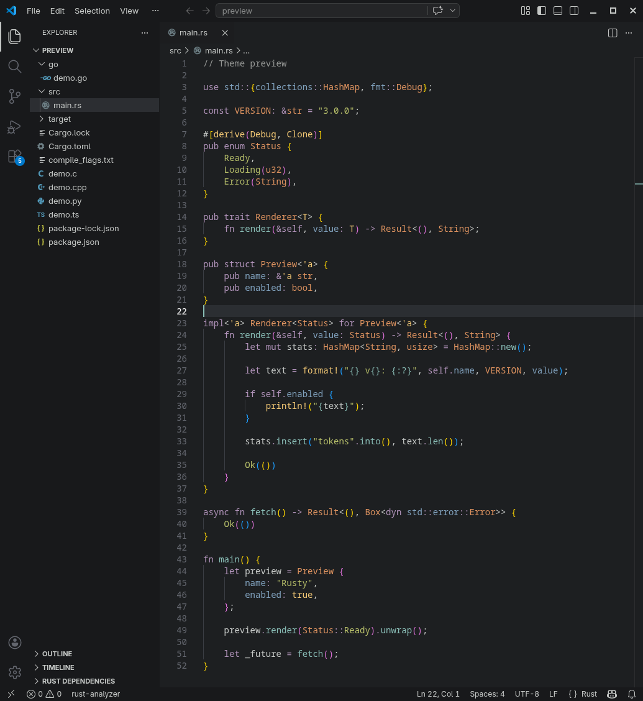
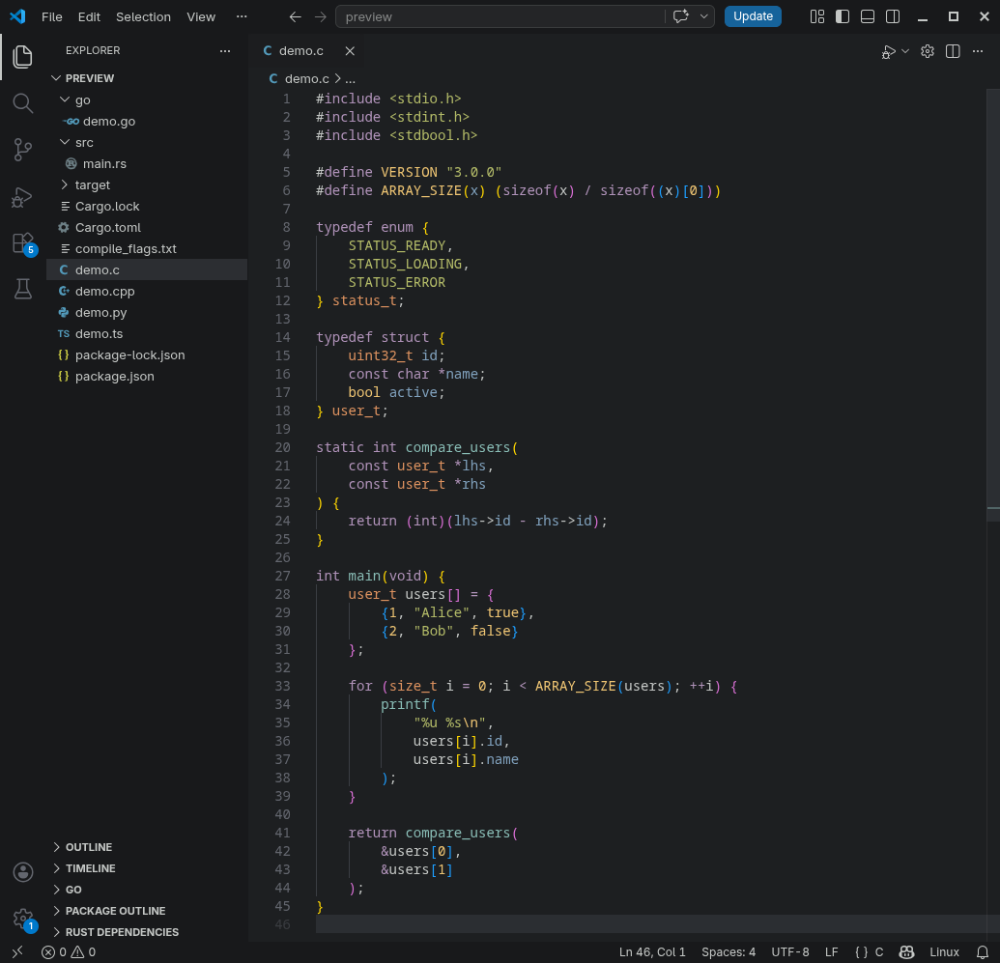
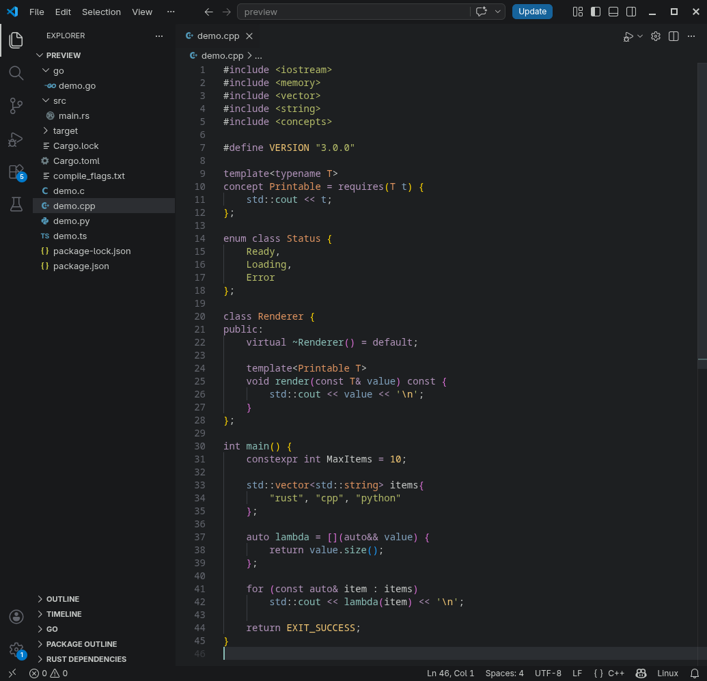
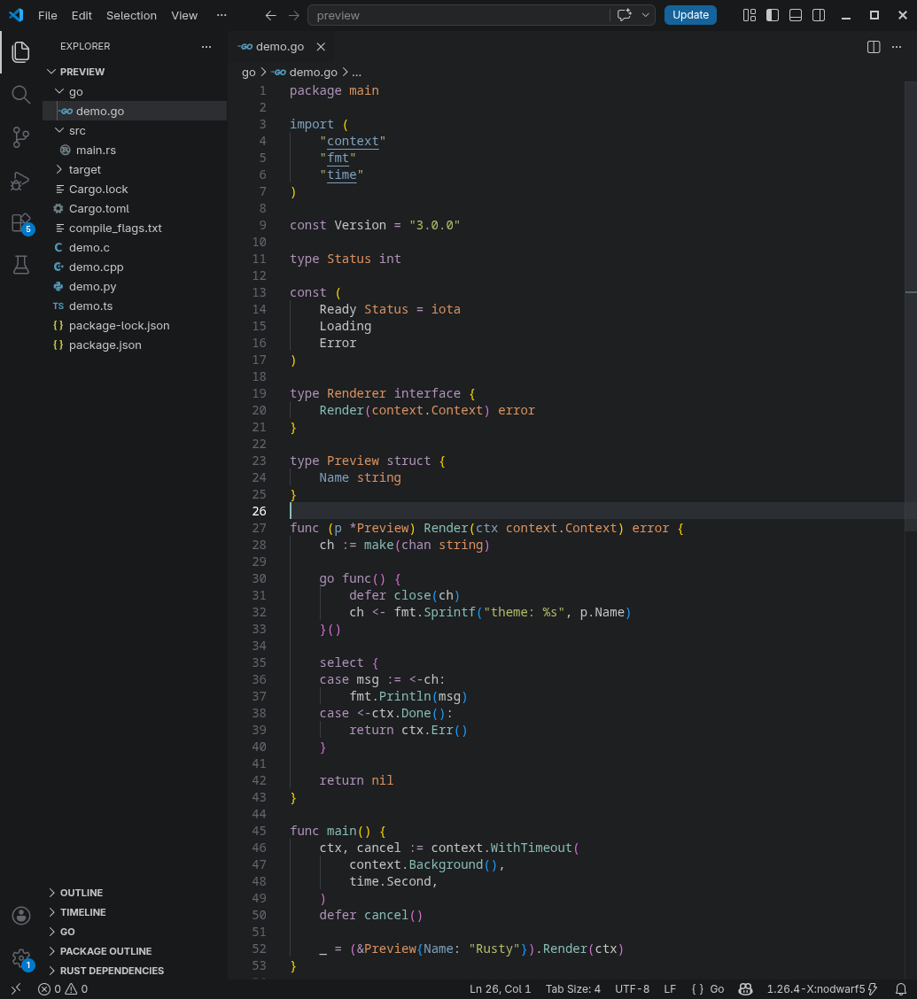
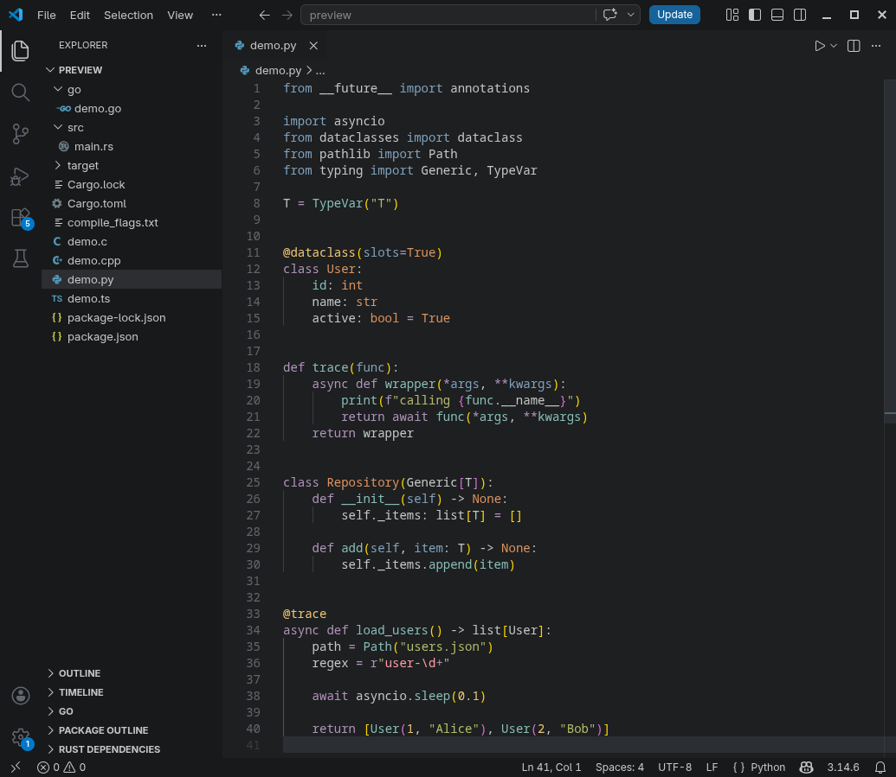
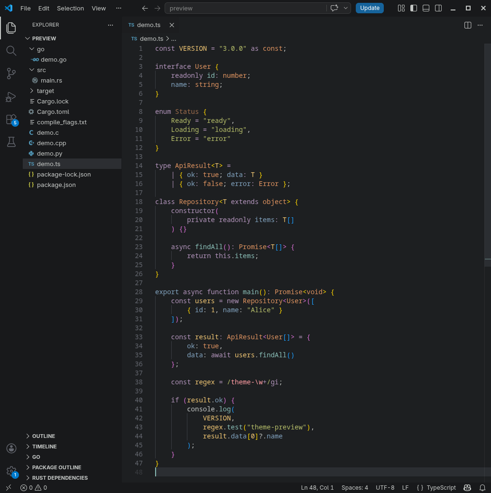

# rusted

A dark VS Code theme inspired by the color palette of [The Rust Programming Language](https://doc.rust-lang.org/book/) code snippets and [rusty.nvim](https://github.com/armannikoyan/rusty).

`rusted` is an unofficial VS Code port with support for semantic highlighting and a wide range of programming languages.

## Recommended settings

Enable semantic highlighting for best experience:

Add this line to your `settings.json`:

```json
"editor.semanticHighlighting.enabled": true,
```

## Preview



<details>
<summary>C, C++, Go, Python, TypeScript examples</summary>

### C



### C++



### Go



### Python



### TypeScript



</details>

## Installation

<details>
<summary>Instructions</summary>

### VS Code Marketplace

Search: **rusted**

### Manual installation

Download `.vsix` file from the latest release [here](https://github.com/sph1nxis/rusted/releases)

Then:
1. Open the **Extensions** sidebar in VS Code: <kbd>Ctrl</kbd> + <kbd>Shift</kbd> + <kbd>X</kbd>
2. Click `...` → `Install from VSIX...`
3. Select your downloaded .vsix file

### Build from source

Dependencies: Node.js, VSCE

```bash
git clone https://github.com/sph1nxis/rusted
cd rusted
npm install
npm run build
vsce package
```

`.vsix` file will be generated.

</details>

## Notes

This project is not affiliated with the Rust project or the rusty.nvim theme.

## Feedback

Bug reports, suggestions, and pull requests are welcome: [issue tracker](https://github.com/sph1nxis/rusted/issues)

