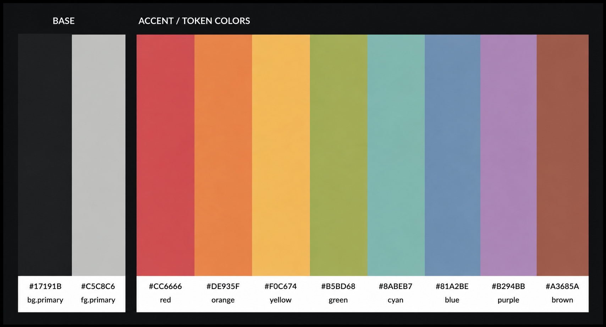

# rusted

A dark VS Code theme inspired by the color palette of [The Rust Programming Language](https://doc.rust-lang.org/book/) code snippets and [rusty.nvim](https://github.com/armannikoyan/rusty).

`rusted` is an unofficial VS Code port with support for semantic highlighting and a wide range of programming languages.

## Recommended settings

Enable semantic highlighting for best experience:

Add this line to your `settings.json`:

```json
"editor.semanticHighlighting.enabled": true,
```

## Preview


<details>
<summary>C, C++, Go, Python, TypeScript examples</summary>

### C


### C++


### Go


### Python


### TypeScript


</details>

## Color palette

<details>
<summary>Palette</summary>



| Category | Name | Color | Usage |
|:---|:---|:---:|:---|
| **Background** | `primary` | `#17191b` | Main editor and workspace background |
| | `secondary` | `#111214` | Sidebars, panels, menus, widgets and other secondary UI |
| | `tertiary` | `#161719` | Active/focused surfaces inside the workspace |
| | `hover` | `#1C1D1F` | Hover state for interactive UI elements |
| **Foreground** | `primary` | `#C5C8C6` | Main text |
| | `secondary` | `#63666E` | Secondary and subdued text |
| | `white` | `#FFFFFF` | High-emphasis text |
| | `bright` | `#F2F2F2` | Bright/high-contrast text |
| **UI** | `comment` | `#969896` | Comments and subdued annotations |
| | `lineHighlight` | `#373B4180` | Current line highlight |
| | `selection` | `#373B41C0` | Active text selection |
| | `inactiveSelection` | `#282A2E50` | Inactive text selection |
| | `indentGuide` | `#373B41` | Borders and indentation guides |
| | `whitespace` | `#4D5057` | Whitespace indicators |
| | `listActiveSelection` | `#282A2E` | Active list/menu selection |
| | `listInactiveSelection` | `#282A2E` | Inactive list/menu selection |
| | `transparent` | `#00000000` | Transparent UI elements |
| **Accent** | `red` | `#CC6666` | |
| | `orange` | `#DE935F` | |
| | `yellow` | `#F0C674` | |
| | `green` | `#B5BD68` | |
| | `cyan` | `#8ABEB7` | |
| | `blue` | `#81A2BE` | |
| | `purple` | `#B294BB` | |
| | `brown` | `#A3685A` | |
| **Muted** | `red` | `#FF9DA4` | |
| | `orange` | `#FFC58F` | |
| | `yellow` | `#FFE2A0` | |
| | `green` | `#D1DA8E` | |
| | `cyan` | `#A5D6CF` | |
| | `blue` | `#A3C2DC` | |
| | `purple` | `#CEB7D7` | |
| | `brown` | `#C08476` | |
| **Bright** | `red` | `#FF5B69` | |
| | `orange` | `#F5A962` | |
| | `yellow` | `#EAB85B` | |
| | `green` | `#AAB257` | |
| | `cyan` | `#7BB2AA` | |
| | `blue` | `#7094B2` | |
| | `purple` | `#A383AD` | |
| | `brown` | `#8F5C52` | |

</details>

## Installation

<details>
<summary>Instructions</summary>

### VS Code Marketplace

Search: **rusted**

### Manual installation

Download `.vsix` file from the latest release [here](https://github.com/sph1nxis/rusted/releases)

Then:
1. Open the **Extensions** sidebar in VS Code: <kbd>Ctrl</kbd> + <kbd>Shift</kbd> + <kbd>X</kbd>
2. Click `...` → `Install from VSIX...`
3. Select your downloaded .vsix file

### Build from source

Dependencies: Node.js, VSCE

```bash
git clone https://github.com/sph1nxis/rusted
cd rusted
npm install
npm run build
vsce package
```

`.vsix` file will be generated.

</details>

## Notes

This project is not affiliated with the Rust project or the rusty.nvim theme.

## Feedback

Bug reports, suggestions, and pull requests are welcome: [issue tracker](https://github.com/sph1nxis/rusted/issues)

